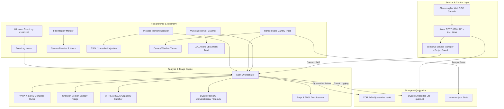

# Project Guard Architecture Specification

This document details the engineering architecture, internal subsystems, concurrency models, and security guarantees of **Project Guard** — a pure Rust Next-Gen Antivirus, EDR (Endpoint Detection & Response), and Threat Hunting platform designed specifically for Windows environments with native Windows Defender coexistence.

---

## 1. High-Level Architectural Overview

Project Guard operates across three main operational planes:
1. **Host Defense & Telemetry Plane**: Low-level kernel driver checks (BYOVD), Windows Event Log telemetry (ETW / Event ID 4104), active memory scanning (`VirtualQueryEx`), and ransomware honeypots.
2. **Analysis & Triage Plane**: Multi-engine orchestrator executing YARA-X compiled rules, section-based Shannon entropy analysis, MITRE ATT&CK capability matching, and IOC extraction.
3. **Control & Response Plane**: Windows Service Control Manager (SCM) background daemon, XOR `0x5A` quarantine vault, RESTful JSON API server, and a Glassmorphic Web SOC console.



---

## 2. Windows Defender Coexistence Architecture (Dual-Layer Shield)

### The Coexistence Problem in Windows
Traditional third-party antivirus software registers with Windows Security Center (`WSC`), which instructs Windows Defender Antivirus to enter passive or disabled mode. Furthermore, naive quarantine engines and file watchers trigger collision loops:
1. When third-party AV writes or moves a malware sample, Windows Defender's kernel filter (`WdFilter.sys`) intercepts the I/O request.
2. If Defender detects the file first, the OS returns error `0x800700E1` or `std::io::ErrorKind::PermissionDenied` / `os error 225` ("Operation did not complete successfully because the file contains a virus or potentially unwanted software").
3. Third-party software crashes or enters an unhandled loop.

### Project Guard's Dual-Layer Solution
1. **Active Intercept & Graceful Degradation**:
   When scanning files or moving infected artifacts, Project Guard explicitly detects raw OS error 225:
   ```rust
   match fs::copy(&infected_path, &vault_temp) {
       Ok(_) => { /* Proceed to isolate */ },
       Err(ref e) if e.raw_os_error() == Some(225) => {
           // Intercepted by Defender WdFilter.sys:
           // Treat as successful active mitigation by primary layer!
       }
       Err(e) => return Err(e.into()),
   }
   ```
2. **Reversible XOR `0x5A` Vault Masking**:
   Quarantined files are not stored as plain bytes. Every byte is XOR-transformed with key `0x5A`:
   $$B_{vault}[i] = B_{original}[i] \oplus \text{0x5A}$$
   - Any PE executable headers (`MZ\x90\x00` $\rightarrow$ `\x17\x00\x6A\x5A`) are rendered completely un-executable by the Windows kernel.
   - Defender does not quarantine the vault repository, preventing false-positive loops.
   - Restoration is instantaneous and lossless: $(B \oplus K) \oplus K = B$.

3. **Unified Telemetry Fusion**:
   Project Guard continuously queries Defender's status via PowerShell CIM bindings (`Get-MpComputerStatus`) and merges Defender's detection events (Event ID 1116 / 1117) into its unified Web SOC Dashboard.

---

## 3. The 26 Security Engines Breakdown

| Category | Engine Name | Detection Methodology | ATT&CK Reference |
|---|---|---|---|
| **Signature & Intel** | `YaraEngine` | Memory-safe YARA-X compiled pattern matching | All Techniques |
| | `HashEngine` | SHA-256 / MD-5 lookups against SQLite local cache | T1204 (User Execution) |
| | `MalwareBazaarFeed` | Daily automated sync of known ransomware & trojans | T1566 (Phishing) |
| | `ThreatFoxFeed` | Live ingestion of malicious C2 IPs & payload URLs | T1071 (Application Layer) |
| | `FeodoTrackerFeed` | Real-time Dridex/Emotet/Qakbot C2 IP verification | T1573 (Encrypted Channel) |
| | `ClamAvEngine` | Native ClamAV `.hdb` hash database & clamd socket | T1027 (Obfuscation) |
| | `YaraForgeSync` | Curated YARA rulesets for Cobalt Strike, APTs & Mimikatz | T1003 (Credential Dumping) |
| | `CisaKevEngine` | CISA Known Exploited Vulnerabilities (BOD 26-04) catalog audit | T1068, T1203, T1210 |
| | `UsomFeed` | T.C. Siber Güvenlik Başkanlığı (USOM) yerli tehdit istihbaratı ve C2 beslemesi | T1071, T1566 |
| | `EpssEngine` | FIRST.org Exploit Prediction Scoring System (EPSS) sömürü olasılığı analizi | T1190, T1203 |
| | `SansDShieldFeed` | SANS Internet Storm Center (ISC) DShield bal küpü küresel saldırgan IP akışı | T1071, T1595 |
| | `SpamhausDropFeed`| The Spamhaus Project DROP/eDROP kurşun geçirmez botnet & C2 alt ağ akışı | T1071, T1584 |
| | `UrlhausFeed` | Abuse.ch URLhaus aktif zararlı indirme ve payload dağıtım bağlantıları | T1566.002, T1204 |
| **Heuristic & PE** | `PeTriager` | Shannon Entropy calculation per section (0.0 - 8.0) | T1027.002 (Software Packing) |
| | `WXViolationEngine` | Identification of dual `WRITE` + `EXECUTE` sections | T1055 (Process Injection) |
| | `CapaCapabilityEngine`| Behavioral API pattern scoring for ransomware & evasion | T1486 (Data Encrypted) |
| | `DriverHunter` | LOLDrivers hash list & vulnerable kernel drivers (BYOVD 2026) | T1068, T1543 (BYOVD) |
| | `UpxCrypterEngine` | Detection of packed executables and modified headers | T1027.002 (Packing) |
| | `SupplyChainScanner`| OpenSSF & OWASP A03 yazılım tedarik zinciri ve kötücül script analizi | T1195.001, T1059 |
| **Memory & Script** | `ProcessMemoryScanner`| Live `VirtualQueryEx` unbacked `PAGE_EXECUTE_READWRITE` | T1055.001 (DLL Injection) |
| | `ScriptHunter` | AST & regex parsing of PowerShell / VBScript / Batch | T1059 (Command & Script) |
| | `AmsiBypassDetector` | Detection of `amsiInitFailed` and memory patch patterns | T1562.001 (Disable Tools) |
| | `LolbasHunter` | EDR-Kill, Anti-Recovery (`vssadmin`, `bcdedit`), Proxy Execution | T1218, T1490, T1562.001 |
| | `StealerHunter` | Shadowserver StealC infostealer tarayıcı ve cüzdan kasa koruması | T1555.003, T1005 |
| | `SigmaEngine` | SigmaHQ açık kaynak kural standartları ile süreç ve komut satırı analizi | T1059, T1098, T1490 |
| | `StalkerwareHunter`| EFF Coalition Against Stalkerware & Citizen Lab casus yazılım ve takip avcısı | T1056.001, T1113 |
| | `IocExtractor` | In-flight decoding of Base64, Bitcoin wallets, and IPs | T1027 (Deobfuscation) |
| **Host Defense** | `EventLogHunter` | Real-time monitoring of Windows Event Log ID 4104/1102 | T1059.001, T1070 (Logs) |
| | `CanaryManager` | CISA Cyber Decoys (Sept 2026): Honeytokens, Vaults, Breadcrumbs | T1486, T1552, MITRE Engage |
| | `FimEngine` | Cryptographic SHA-256 integrity checks on hosts/system | T1565 (Data Manipulation) |
| | `CisAuditEngine` | Center for Internet Security (CIS) Controls v8.1 ve Windows Benchmark | Enterprise Hardening |
| | `UsbMonitor` | Plug-and-play removable drive scanning for LNK worms | T1091 (Replication Media) |
| | `PrivacyGuard` | Windows ConsentStore donanım kamera & mikrofon aktif erişim denetimi | T1125, T1123 |
| | `SystemModeEngine` | WinDebloat tarzı Oyun / İş Modu ve telemetri optimizasyonu (Rollback) | Performance & Privacy |


---

## 4. Extensions & Ecosystem Integration

### Chrome Extension (Manifest V3 - Web Shield)
Located at `extensions/chrome/`:
- **Real-Time Phishing & C2 Interceptor**: Inspects active tab navigation against malicious TLDs, raw IP connection patterns, and credential-harvesting keywords.
- **Dual-Extension Lure Detection**: Content script highlights disguised files (e.g. `.docx.exe`, `.pdf.vbs`) and flags insecure HTTP credential forms.
- **REST API Synchronization**: Polls Project Guard desktop daemon on `http://localhost:7890` with glassmorphic SOC popup.

### Docker Desktop Extension (Container & Image Security EDR)
Located at `extensions/docker/`:
- **Runtime Privilege & Vulnerability Inspection**: Interacts with `window.ddClient` to list running containers and detects high-risk flags (`--privileged`, `hostPID`, suspicious C2 ports 4444/1337).
- **Image Scanning & CIS Hardening Benchmark**: Evaluates local Docker images for outdated bases and provides interactive container security compliance checklists.
- **Host EDR Bridge**: Seamlessly synchronizes container telemetry with host daemon at `host.docker.internal:7890`.

---

## 5. Windows Native Integration & Shell Ecosystem

Project Guard provides deep, native integration across the Windows operating system:
1. **Windows Explorer Shell Context Menu**:
   - Right-click scanning registered in Registry (`HKCU\Software\Classes\*\shell\ProjectGuardScan` and `Directory\shell\ProjectGuardScan`).
   - Enables instant file and folder analysis directly from Windows File Explorer with custom security icons.
2. **Native Windows Toast Notifications**:
   - Dispatches non-blocking visual and audio alert toasts into Windows 10/11 Action Center upon malware detection or canary tripping.
3. **Windows Service Control Manager (SCM)**:
   - 24/7 background SYSTEM daemon with multi-stage failure restart recovery policies (5s, 10s, 20s).
4. **Volume Shadow Copy & Anti-Ransomware Guard**:
   - Active interception of VSS tampering commands (`vssadmin delete shadows`, `wmic shadowcopy delete`).

---

## 6. Windows Service Architecture & Lifecycle

The background service integrates with the Windows **Service Control Manager (SCM)** using standard system APIs (`sc.exe` and native Windows threading).

```
   ┌────────────────────────────────────────────────────────┐
   │             Windows Service Control Manager            │
   └───────────────────────────┬────────────────────────────┘
                               │ sc.exe start ProjectGuard
                               ▼
   ┌────────────────────────────────────────────────────────┐
   │     project-guard.exe service run (SYSTEM Context)     │
   └─────────────┬────────────────────────────┬─────────────┘
                 │                            │
                 ▼                            ▼
   ┌───────────────────────────┐┌───────────────────────────┐
   │ Canary Monitor Thread     ││ Main Watchdog Loop        │
   │ Checks honeypot canaries  ││ Heartbeat logging         │
   │ Every 3 seconds           ││ EventLog / FIM checks     │
   │ Triggers emergency alerts ││ Every 10 seconds          │
   └───────────────────────────┘└───────────────────────────┘
```

### Auto-Recovery Configuration
When registered via `project-guard service install`, Project Guard configures the SCM failure policy:
- **First Failure**: Restart service after 5,000 ms.
- **Second Failure**: Restart service after 10,000 ms.
- **Subsequent Failures**: Restart service after 20,000 ms.
- **Fail Count Reset**: 86,400 seconds (24 hours).

---

## 6. Concurrency & Memory Safety Guarantees

1. **Zero-Cost Abstractions & No Garbage Collector**:
   Written in **Rust 2024 Edition**, memory safety is mathematically enforced by the compiler's affine type system. No data races, no memory leaks, and no use-after-free conditions are possible in safe blocks.
2. **Thread Isolation**:
   - The Web UI runs asynchronously on **Tokio** multi-threaded runtime.
   - The Windows Service daemon and Canary monitoring run on dedicated OS threads with atomic synchronizations (`std::sync::atomic::AtomicBool`).
   - The Database layer utilizes connection pools with thread-safe Mutex wrappers.
3. **PE Parser Safety**:
   PE parsing is executed via the `object` crate, completely sandboxed from unchecked pointer arithmetic, eliminating parser vulnerability exploits common in legacy C++ AV products.

---

## 7. Directory Layout & Data Storage

All operational data is maintained in `.project_guard/`:

```
.project_guard/
├── guard.db            # SQLite 3 WAL database storing IOCs, threat rules, and detection history
├── canaries.json       # Metadata and state of active ransomware canary traps
├── fim_baseline.json   # Cryptographic SHA-256 baselines of protected system binaries
├── service.log         # 24/7 Windows Service heartbeat and event log
├── quarantine/         # XOR 0x5A encrypted quarantine vault
└── rules/              # Compiled YARA rules and community threat signatures
```
